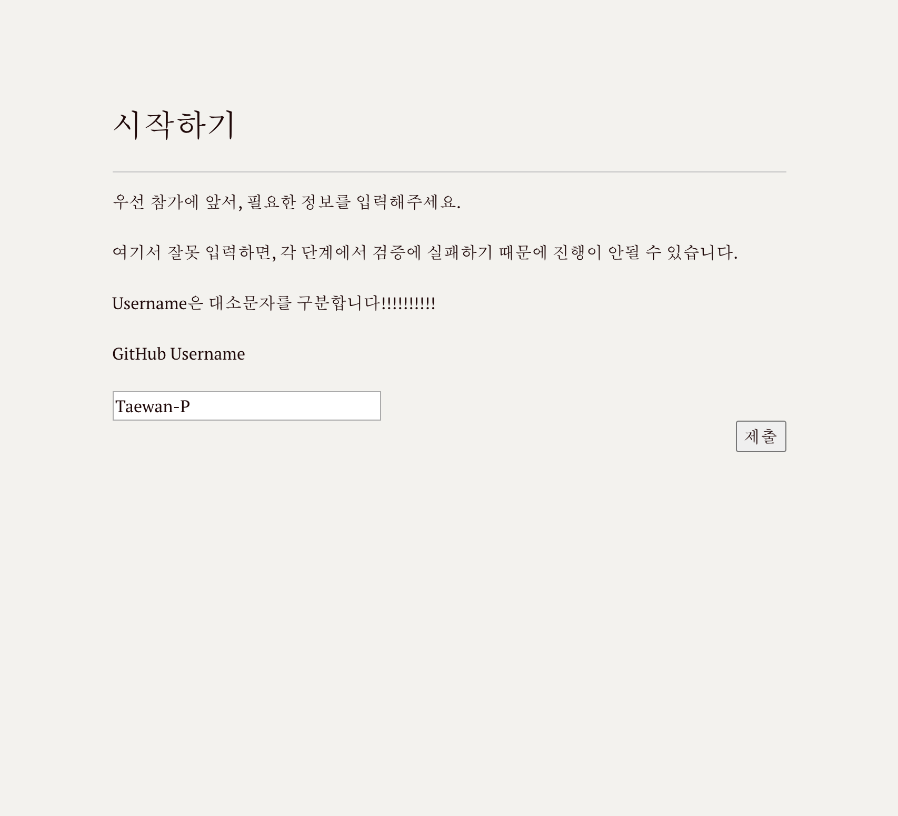
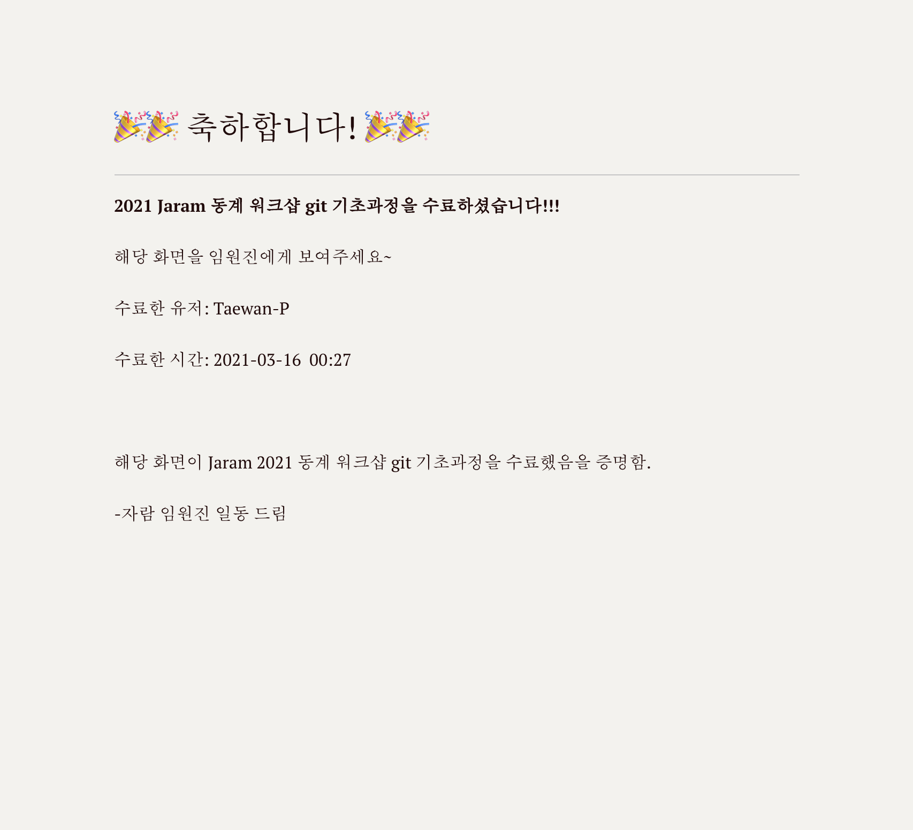

# workshop-validator
Jaram 2021 winter workshop git practices course validator

## 개요

신입생들의 git 능력을 향상시키기 위해 만든 git 온라인 퀴즈 입니다.

2021 겨울 동계 워크샵에서 신입생 대상으로 진행한 워크샵입니다.

각 단계별로 문제가 있고, 해당 작업을 진짜 수행했는지 서버가 검증한 후, 다음 단계로 넘어갑니다.

## 스크린샷

